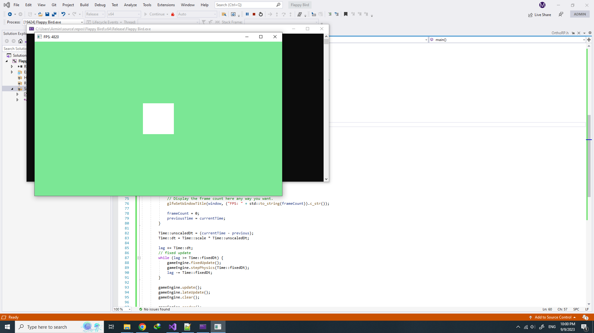

# ZeroEngine
Zero is a game engine/framework written for c++ with simplicity and functionality in mind.<br />
Zero has been designed to be both user friendly and configurable. The only hard requirements are C++ 17, opengl 3.3 or later and glm.<br /><br />
Special thanks to @royvandam for his <a href="https://github.com/royvandam/rtti">rtti</a> library.

## Structure
The engine class controls all entities and their components. And the pipelines manage extra functionality such as rendering, audio, physics and etc.<br />
Currently only render and physics pipelines have been implemented.

## Quickstart
I currently use GLAD for loading opengl and GLFW for window management in my examples. But the engine doesn't strictly require them and you can use any other library you want.
```cpp
#include <glad/glad.h>
#include <GLFW/glfw3.h>

#include <Zero/engine.h>

Engine gameEngine;

namespace Time {
    double scale = 1.0;
    double unscaledDt = 0.0;
    double dt = 0.0;
    double fixedDt = 1.0 / 120.0;
}

void framebuffer_size_callback(GLFWwindow* window, int width, int height);

int main() {

    // glfw: initialize and configure
    // ------------------------------
    glfwInit();
    glfwWindowHint(GLFW_CONTEXT_VERSION_MAJOR, 4);
    glfwWindowHint(GLFW_CONTEXT_VERSION_MINOR, 0);
    glfwWindowHint(GLFW_OPENGL_PROFILE, GLFW_OPENGL_CORE_PROFILE);

#ifdef __APPLE__
    glfwWindowHint(GLFW_OPENGL_FORWARD_COMPAT, GL_TRUE);
#endif

    // glfw window creation
    // --------------------
    GLFWwindow* window = glfwCreateWindow(800, 500, "ZeroEngine", NULL, NULL);
    if (window == NULL)
    {
        std::cout << "Failed to create GLFW window" << std::endl;
        glfwTerminate();
        return -1;
    }
    glfwMakeContextCurrent(window);
    glfwSetFramebufferSizeCallback(window, framebuffer_size_callback);

    // glad: load all OpenGL function pointers
    // ---------------------------------------
    if (!gladLoadGLLoader((GLADloadproc)glfwGetProcAddress))
    {
        std::cout << "Failed to initialize GLAD" << std::endl;
        return -1;
    }

    stbi_set_flip_vertically_on_load(true); // tell stb image to load textures normally
    gameEngine.init(); // init the game engine

    glViewport(0, 0, 800, 500);

    double previousTime = glfwGetTime();
    double previous = previousTime;
    double lag = 0.0f;
    int frameCount = 0;
    while (!glfwWindowShouldClose(window)) {
        // Measure speed
        double currentTime = glfwGetTime();
        frameCount++;
        // If a second has passed.
        if (currentTime - previousTime >= 1.0)
        {
            // Display the frame count here any way you want.
            glfwSetWindowTitle(window, ("FPS: " + std::to_string(frameCount)).c_str());

            frameCount = 0;
            previousTime = currentTime;
        }

        Time::unscaledDt = (currentTime - previous);
        Time::dt = Time::scale * Time::unscaledDt;

        lag += Time::dt;
        // fixed update
        while (lag >= Time::fixedDt) {
            gameEngine.fixedUpdate();
            gameEngine.stepPhysics(Time::fixedDt);
            lag -= Time::fixedDt;
        }

        gameEngine.update();
        gameEngine.lateUpdate();
        gameEngine.clear();

        gameEngine.render();

        glfwSwapBuffers(window);
        glfwPollEvents();

        previous = currentTime;
    }

    glfwTerminate();
    return 0;
}

void framebuffer_size_callback(GLFWwindow* window, int width, int height) {
    glViewport(0, 0, width, height);
}
```
In the code above we have initialized the game engine and made a simple execution loop. After running it, a black window appears and writes the FPS in the window title. Let's add some graphics to it. Currently the engine comes with a simple render pipeline which is called "OrthoRP". OrthoRP has been designed exclusively for 2D graphics. To make it work we need to add "#include <Zero/OrthoRP.h>" after "#include <Zero/engine.h>". Now let's add some entities.
```cpp
#include <glad/glad.h>
#include <GLFW/glfw3.h>

#include <Zero/engine.h>
#include <Zero/OrthoRP.h>

/* the code */

    stbi_set_flip_vertically_on_load(true); // tell stb image to load textures normally
    gameEngine.init(); // init the game engine
    gameEngine.setRenderPipeline(new OrthoRP());

    Entity* e1 = gameEngine.createEntity();
    Camera* cam = e1->addComponent<Camera>();
    cam->background = Vec3(0.2f, 0.8f, 0.3f);

    Entity* e2 = gameEngine.createEntity();
    RenderSprite* rs = e2->addComponent<RenderSprite>();

/* rest of the code */
```
As you see we have added an entity called "e1" and attached the "Camera" component to it. The "Camera" component is an essential part and without it, nothing would be drawn on screen. And we have added a "RenderSprite" component to "e2" entity. The RenderSprite component handles the way the entity is drawn on screen. Now if run the code, you should see a green background and a white square at the center of screen.<br /><br />
<br /><br />
Now let's transform "e2" and add a sprite to it.
```cpp
Entity* e2 = gameEngine.createEntity();
RenderSprite* rs = e2->addComponent<RenderSprite>();
e2->transform->setPosition(Vec3(1.5f, 1.5f, 0.0f));
rs->sprite = gameEngine.loadTexture("sprite.png");
```
In the code above we have moved the entity and add a sprite to it. The sprite has been loaded with "loadTexture" function which takes care of garbage colleciton of textures.
